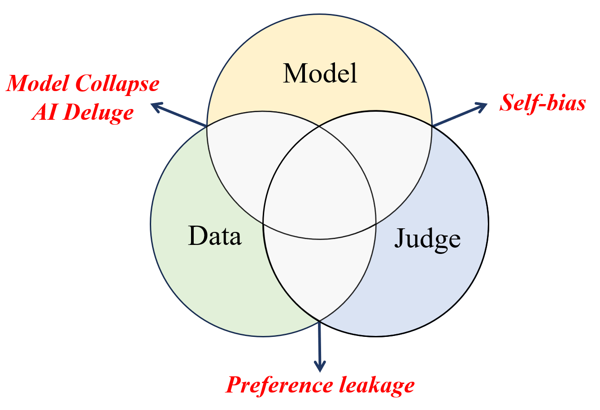

# AI Supervision Risk

[](https://awesome.re)  

- This repo include the papers discussed risks and challenges in AI supervision, i.e. data synthesis and LLM-as-a-judge. Corresponding to Dawei Li (daweili5@asu.edu).

- While these AI supervision paradigms bring convenience and efficiency, it's crucial to recognize that this new paradigm blurs the boundaries between models, data, and evaluation methods, posing potential risks and challenges.

- Want to know more about AI supervision in the era of LLMs? Check out our paper list about [LLM-based data synthesis](https://github.com/llm-as-a-judge/Awesome-LLM-as-a-judge) and [LLM-as-a-judge](https://github.com/Zhen-Tan-dmml/LLM4Annotation)!

<div style="text-align: center;">
  
</div>

## Model Collapse
- **AI models collapse when trained on recursively generated data**. *Nature* (2024) [[Paper]](https://www.nature.com/articles/s41586-024-07566-y)
- **A Tale of Tails: Model Collapse as a Change of Scaling Laws**. *Arxiv* (2024) [[Paper]](https://arxiv.org/abs/2402.07043)
- **How Bad is Training on Synthetic Data? A Statistical Analysis of Language Model Collapse**. *Arxiv (2024)* [[Paper]](https://arxiv.org/abs/2404.05090)
- **Strong Model Collapse**. *Arxiv (2024)* [[Paper]](https://arxiv.org/abs/2410.04840)

## AI Deluge
- **Neural Retrievers are Biased Towards LLM-Generated Content**. *KDD (2024)* [[Paper]](https://dl.acm.org/doi/abs/10.1145/3637528.3671882?casa_token=4Lrwrk5uhakAAAAA:XP2Tje_6XU-rK_CbHHfDZYyQKyqgOWgPzuUIbx4cA0xigm22nJJZ-0Ze3WDiXtq2K5zbKg0ILfnH)
- **Bias and Unfairness in Information Retrieval Systems: New Challenges in the LLM Era**. *KDD (2024)* [[Paper]](https://dl.acm.org/doi/abs/10.1145/3637528.3671458)
- **Spiral of Silence: How is Large Language Model Killing Information Retrieval? -- A Case Study on Open Domain Question Answering**. *ACL (2024)* [[Paper]](https://arxiv.org/abs/2404.10496)
- **Invisible Relevance Bias: Text-Image Retrieval Models Prefer AI-Generated Images**. *SIGIR (2024)* [[Paper]](https://dl.acm.org/doi/abs/10.1145/3626772.3657750)
- **Perplexity Trap: PLM-Based Retrievers Overrate Low Perplexity Documents**. *ICLR (2025)* [[Paper]](https://openreview.net/forum?id=U1T6sq12uj)
- **Cocktail: A Comprehensive Information Retrieval Benchmark with LLM-Generated Documents Integration**. *ACL (2024)* [[Paper]](https://aclanthology.org/2024.findings-acl.421.pdf) [[Benchmark]](https://github.com/KID-22/Cocktail)
- **Generative Ghost: Investigating Ranking Bias Hidden in AI-Generated Videos**. *Arxiv (2025)* [[Paper]](https://arxiv.org/pdf/2502.07327)
- **Source Echo Chamber: Exploring the Escalation of Source Bias in User, Data, and Recommender System Feedback Loop**. *Arxiv (2024)* [[Paper]](https://arxiv.org/abs/2405.17998)


## Self-bias
- **Self-Preference Bias in LLM-as-a-Judge**. *Arxiv (2024)* [[Paper]](https://arxiv.org/abs/2410.21819)
- **LLMs as Narcissistic Evaluators: When Ego Inflates Evaluation Scores**. *Arxiv (2023)* [[Paper]](https://arxiv.org/abs/2311.09766)
- **Benchmarking Cognitive Biases in Large Language Models as Evaluators**. *ACL (2024)* [[Paper]](https://arxiv.org/abs/2309.17012)
- **LLM Evaluators Recognize and Favor Their Own Generations**. *NeurIPS (2024)* [[Paper]](https://proceedings.neurips.cc/paper_files/paper/2024/hash/7f1f0218e45f5414c79c0679633e47bc-Abstract-Conference.html)
- **Justice or Prejudice? Quantifying Biases in LLM-as-a-Judge**. *ICLR (2024)* [[Paper]](https://arxiv.org/abs/2410.02736)
- **Pride and Prejudice: LLM Amplifies Self-Bias in Self-Refinement**. *Arxiv (2024)* [[Paper]](https://arxiv.org/abs/2402.11436)
- **Style Over Substance: Evaluation Biases for Large Language Models**. *Arxiv (2023)* [[Paper]](https://arxiv.org/abs/2307.03025)

## Preference Leakage
- **Preference Leakage: A Contamination Problem in LLM-as-a-judge**. *ArXiv (2025)* [[Paper]](https://arxiv.org/abs/2502.01534)
- **Great Models Think Alike and this Undermines AI Oversight**. *ArXiv (2025)* [[Paper]](https://arxiv.org/abs/2502.04313)

## Reference
If this paper list is useful for your research, please kindly cite the following papers:
```
@article{li2024llmasajudge,
  title   = {From Generation to Judgment: Opportunities and Challenges of LLM-as-a-judge},
  author  = {Dawei Li and Bohan Jiang and Liangjie Huang and Alimohammad Beigi and Chengshuai Zhao and Zhen Tan and Amrita Bhattacharjee and Yuxuan Jiang and Canyu Chen and Tianhao Wu and Kai Shu and Lu Cheng and Huan Liu},
  year    = {2024},
  journal = {arXiv preprint arXiv: 2411.16594}
}

@article{tan2024large,
  title={Large language models for data annotation: A survey},
  author={Tan, Zhen and Li, Dawei and Wang, Song and Beigi, Alimohammad and Jiang, Bohan and Bhattacharjee, Amrita and Karami, Mansooreh and Li, Jundong and Cheng, Lu and Liu, Huan},
  journal={arXiv preprint arXiv:2402.13446},
  year={2024}
}
```
